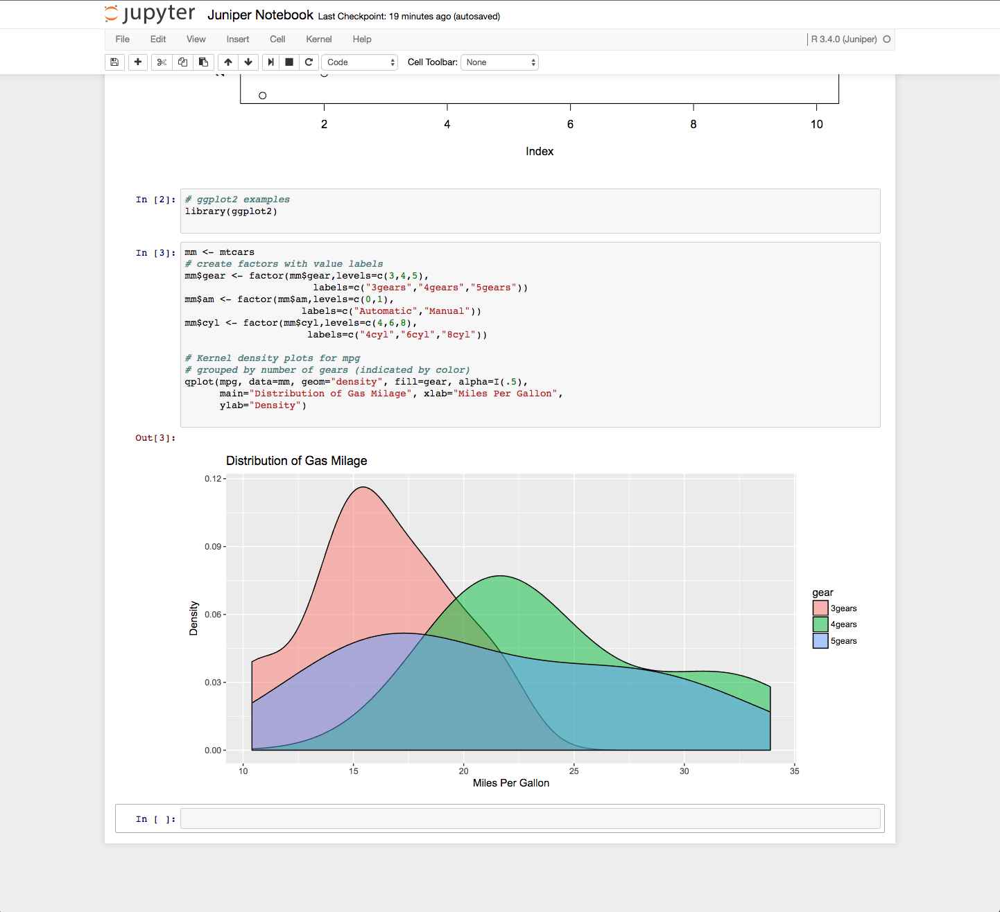
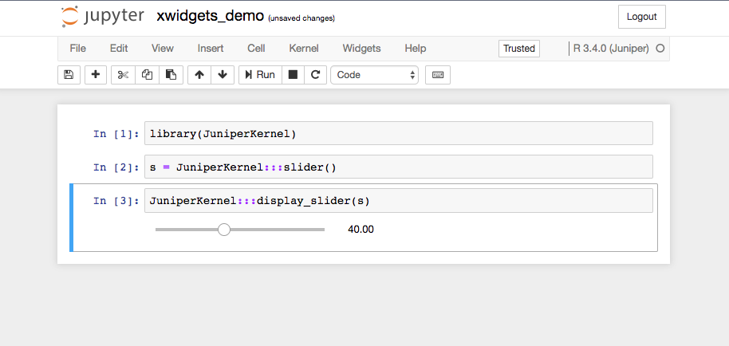
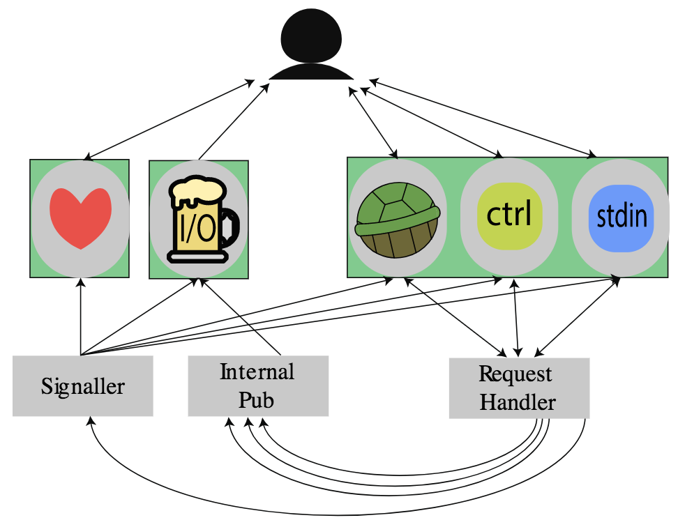

Juniper Kernel 
==============================================================================

[](https://travis-ci.org/JuniperKernel/JuniperKernel)
[](https://ci.appveyor.com/project/spennihana/juniperkernel)


An [R](https://cran.r-project.org/) kernel for [Jupyter](https://jupyter.org) based on [Xeus](https://github.com/QuantStack/xeus) and built with [Rcpp](http://www.rcpp.org/).

## Building

##### Requirements

- R >= 3.4.0 
- R packages: BH,  Rcpp (>= 0.11.0), gdtools (>= 0.1.6), roxygen2, jsonlite, repr
- [Rtools34.exe](https://cran.r-project.org/bin/windows/Rtools/) for Windows

Other necessary bacon bits (fetched automatically--c.f. Makevars/Makevars.win):

- zeromq (4.4.2)
- xeus (0.6.0)
- xtl (0.2.3)

#### Building on Windows

Supported compilers:
 - mingw64 (bundled with Rtools)
 - no other compilers are officially supported (though you may have success via cygwin)

Supported architectures:
 - 64 bit arch

To build and install the Juniper kernel run the following from a `cmd` prompt:

```
cmd /c mk.bat
```

Alternatively, you can run the build from RStudio. 

You should see the following compilation output:

```
C:/Rtools/mingw_64/bin/g++  -std=gnu++11 -I"C:/PROGRA~1/R/R-34~1.1/include" -DNDEBUG -I../inst/include -I. -Wno-conversion-null -I"C:/Program Files/R/R-3.4.1/library/Rcpp/include" -I"C:/Program Files/R/R-3.4.1/library/gdtools/include" -I"C:/Program Files/R/R-3.4.1/library/BH/include"   -I"d:/Compiler/gcc-4.9.3/local330/include"     -O2 -Wall  -mtune=core2 -c RcppExports.cpp -o RcppExports.o
C:/Rtools/mingw_64/bin/g++  -std=gnu++11 -I"C:/PROGRA~1/R/R-34~1.1/include" -DNDEBUG -I../inst/include -I. -Wno-conversion-null -I"C:/Program Files/R/R-3.4.1/library/Rcpp/include" -I"C:/Program Files/R/R-3.4.1/library/gdtools/include" -I"C:/Program Files/R/R-3.4.1/library/BH/include"   -I"d:/Compiler/gcc-4.9.3/local330/include"     -O2 -Wall  -mtune=core2 -c juniper.cpp -o juniper.o
C:/Rtools/mingw_64/bin/g++ -shared -s -static-libgcc -o JuniperKernel.dll tmp.def RcppExports.o juniper.o -lzmq -Lx64 -Ld:/Compiler/gcc-4.9.3/local330/lib/x64 -Ld:/Compiler/gcc-4.9.3/local330/lib -LC:/PROGRA~1/R/R-34~1.1/bin/x64 -lR
installing to C:/Program Files/R/R-3.4.1/library/JuniperKernel/libs/x64
** R
** inst
** preparing package for lazy loading
No man pages found in package  'JuniperKernel' 
** help
*** installing help indices
** building package indices
** testing if installed package can be loaded
* DONE (JuniperKernel)
```

#### Building on macOS

You may install via RStudio, or via terminal with

```
$ make
$ make install
```

which produces the following output:

```
* installing to library ‘/Library/Frameworks/R.framework/Versions/3.4/Resources/library’
* installing *source* package ‘JuniperKernel’ ...
** libs
clang++ -std=gnu++11 -I/Library/Frameworks/R.framework/Resources/include -DNDEBUG -I../inst/include/ -I../inst/include/xeus -I. -I"/Library/Frameworks/R.framework/Versions/3.4/Resources/library/Rcpp/include" -I"/Library/Frameworks/R.framework/Versions/3.4/Resources/library/gdtools/include" -I"/Library/Frameworks/R.framework/Versions/3.4/Resources/library/BH/include" -I/usr/local/include   -fPIC  -Wall -g -O2 -c RcppExports.cpp -o RcppExports.o
clang++ -std=gnu++11 -I/Library/Frameworks/R.framework/Resources/include -DNDEBUG -I../inst/include/ -I../inst/include/xeus -I. -I"/Library/Frameworks/R.framework/Versions/3.4/Resources/library/Rcpp/include" -I"/Library/Frameworks/R.framework/Versions/3.4/Resources/library/gdtools/include" -I"/Library/Frameworks/R.framework/Versions/3.4/Resources/library/BH/include" -I/usr/local/include   -fPIC  -Wall -g -O2 -c juniper.cpp -o juniper.o
clang++ -std=gnu++11 -dynamiclib -Wl,-headerpad_max_install_names -undefined dynamic_lookup -single_module -multiply_defined suppress -L/Library/Frameworks/R.framework/Resources/lib -L/usr/local/lib -o JuniperKernel.so RcppExports.o juniper.o -lzmq -L../inst/zmq -Wl,-rpath,/Library/Frameworks/R.framework/Resources/library/JuniperKernel/zmq -F/Library/Frameworks/R.framework/.. -framework R -Wl,-framework -Wl,CoreFoundation
installing to /Library/Frameworks/R.framework/Versions/3.4/Resources/library/JuniperKernel/libs
** R
** inst
** preparing package for lazy loading
** help
*** installing help indices
** building package indices
** testing if installed package can be loaded
* creating tarball
packaged installation of ‘JuniperKernel’ as ‘JuniperKernel_0.0.0.1.tgz’
* DONE (JuniperKernel)
```

### Installing the Juniper Kernel

##### Jupyter Requirements

These are the notebook versions that are compatible with the Juniper kernel:
```
notebook version: 5.0.0
jupyter_client version: 5.1.0
jupyter_core version: 4.3.0
```

If you want to also enable widgets, this is the compatible version:

```
widgetsnbextension version: 3.0.2
```

Note also that Juniper installation depends on `jupyter kernelspec` being available:

```
$ jupyter kernelspec --version
5.1.0
```

##### Juniper Kernel Installation

The Juniper kernel is installed via the R package that was just built and installed:

```
$ R
> library(JuniperKernel)
> installJuniper()
[InstallKernelSpec] Installed kernelspec juniper_r3.4.1 in /PATH/TO/jupyter/kernels/juniper_r3.4.1
```

You may also install into a virtual environment, provide your own names, and install under different R versions.
To list all of the available kernels you may run:
```
$ jupyter kernelspec list

```

or you can do it from the R package:

```
> JuniperKernel::listKernels()
```


#### Juniper In Action

Juniper Screenshot:




#### xwidgets demo:

xwidgets integration screenshot:



# Architecture Overview

Juniper is a from-scratch Jupyter kernel implementing the 5.2 Jupyter messaging protocol and extending xeus
for custom messaging. The zeromq architecture handles R stdout/stderr in a novel 
way by listening on regular TCP sockets that R scribbles in via `socketConnection`s. 

Here's a diagram of the architecture:

<p align="center">
  
</p>

Despite the number of arrows and boxes in the diagram, the architecture is about as straightfoward 
as you'd expect it to be after a read-through of the docs. There's a client that connects to five 
sockets exposed by the kernel (`heartbeat`, `iopub`, `shell`, `ctrl`, `stdin`), a request handler, and two 
internal sockets to handle ipc. Green boxes represent independent threads: heartbeat gets its own 
thread; IOPub gets its own thread; and shell, ctrl, stdin all share the same thread. The need for 
the signaller and internal publisher may not be obvious; but a read-through of both the Jupyter 
and ZeroMQ docs make it evident that if you're going to have a multi-threaded zmq architecture, 
you'll need a mechanism of ipc (with the additional wrinkle of portability). Practically speaking you'll 
need some way of sending shutdowns to socket pollers (the signaller's job); 
and you'll need a way of ack'ing client requests with a 'busy' signal over IOPub or sending partial 
results (since you can't just magically reach into that thread and say `iopub_sock.send('busy')`, 
and so you have the internal publisher pass the message along).

In order to start the kernel, a client forks off a new process with some JSON in a `connection_file`. 
Primarily this file instructs the kernel about the transport mechanism (tcp, ipc, etc.), ip address, and ports for all sockets:

```
 // sample connection_file
{
 "iopub_port": 59992,
 "stdin_port": 59993,
 "key": "8de88e2a-05ef-4ac8-9af0-000d6389cbc8",
 "shell_port": 59991,
 "transport": "tcp",
 "hb_port": 59995,
 "ip": "127.0.0.1",
 "control_port": 59994,
 "signature_scheme": "hmac-sha256"
}
```

More details in the docs. The kernel boot sequence goes like this:

1. Read connection_file
2. Bind the internal pub/sig sockets
3. Start the heartbeat/iopub threads
4. Bind the ctrl/shell sockets
5. Poll the ctrl/shell sockets forever

The heartbeat and iopub threads do exactly what the main thread does in binding sockets to the 
right ports, connecting to the necessary inproc topics, and properly breaking out of an infinite 
poll loop when signalled. By decree of the ZMQ docs, each thread is responsible for its own socket 
creation/teardown; therefore, it should strike you that since all of the logic is the same, all of 
the startup/poll/shutdown code should be shared. And to a large degree it is. You do need some 
individuality so that messages can be ushered to the right handlers, but a generic solution is helpful 
for maintenance.

#### Request Handling and Execution
`ctrl` and `shell` receive the preponderance of client requests, and these are all handled 
in a single-threaded fashion. Heartbeats are implemented with a plain-old echo socket that 
pongs back whatever binary data the client pings the kernel with. It's worth noting that if 
your kernel doesn't support a multithreaded model, then your kernel will run into hot water 
when launching code-execution requests that require execution times on the order of the elapsed 
time between heartbeats; from the client's perspective the kernel looks non-responsive since your 
kernel has no way of saying it's not just stuck in 'busy' and doing real work.

When a request comes in over a channel, there's some boilerplate handling to decode the message, 
do validation, read off its type bits, create a reply, and finally ship the reply back over the 
channel to the client. Reply content is created by doing some work in the language-specific engine 
(e.g., `plot(x,y)` or `hist(data)`) and then handing back any results to be packaged for client 
consumption. The request handler, therefore, is the most appropriate place to draw a boundary where 
the zeromq architecture can be abstracted away from the code-exec'ing one.
